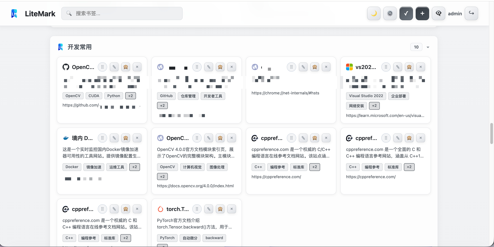
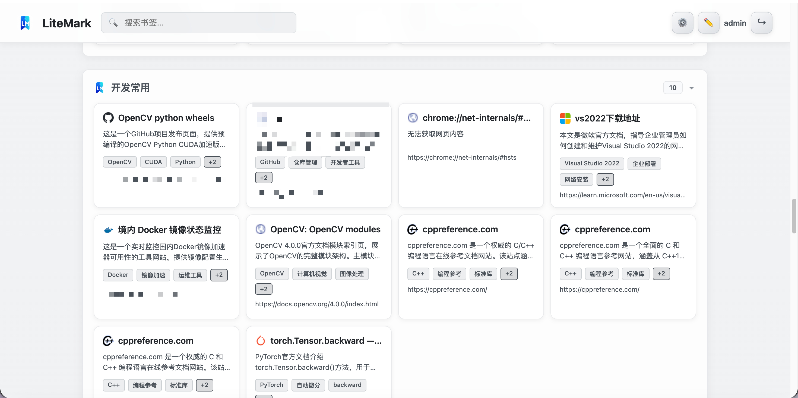
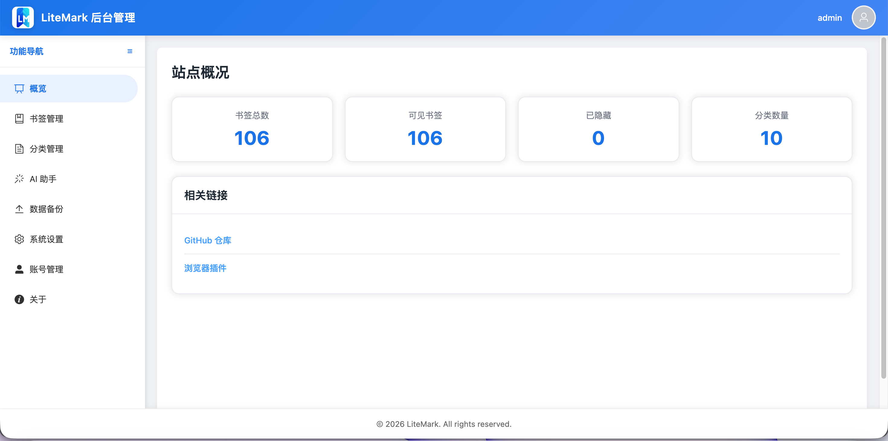
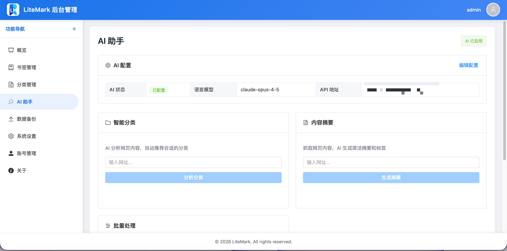

<p align="center">
    <a href="https://github.com/topqaz/LiteMark" target="_blank" rel="noopener noreferrer">
        
    </a>
</p>
<p align="center"><b>LiteMark，</b>轻量易用的书签导航系统</p>

---

LiteMark 是一款基于 **Vue 3 + FastAPI** 的个人书签管理应用，提供响应式双端体验、后台管理面板、AI 智能功能以及多种部署方式。

---

## 功能亮点

- 📚 **书签管理**：支持添加、编辑、删除、隐藏与排序；分类顺序与分类内顺序均可拖拽调整
- 🤖 **AI 智能功能**：智能分类推荐、内容摘要生成、标签提取、快速添加书签
- 🔐 **后台面板**：位于 `/admin`，含登录校验、站点设置、备份管理等
- 💾 **WebDAV 定时备份**：支持配置 WebDAV 服务器，实现定时自动备份
- 🐳 **Docker 部署**：一键部署，支持 x64 和 ARM64 架构

---

## 快速开始

### Docker 部署（推荐）

```bash
# 使用 docker-compose
curl -O https://raw.githubusercontent.com/topqaz/LiteMark/main/docker-compose.yml
docker-compose up -d

# 或直接使用 docker run
docker run -d -p 8080:80 \
  -v litemark-data:/app/data \
  -e JWT_SECRET=your-secret-key \
  -e DEFAULT_ADMIN_USERNAME=admin \
  -e DEFAULT_ADMIN_PASSWORD=admin123 \
  --name litemark \
  topqaz/litemark:x64
```
# 或 ARM64 架构使用： topqaz/litemark:arm64

访问地址：`http://localhost:8080`，后台入口：`http://localhost:8080/admin`

### docker-compose.yml 示例

```yaml
services:
  litemark:
    image: topqaz/litemark:latest
    container_name: litemark
    restart: unless-stopped
    ports:
      - "8080:80"
    volumes:
      - litemark-data:/app/data
    environment:
      - JWT_SECRET=change-this-to-a-secure-random-string
      - DATABASE_URL=sqlite+aiosqlite:///./data/litemark.db
      - DEFAULT_ADMIN_USERNAME=admin
      - DEFAULT_ADMIN_PASSWORD=admin123
      - DEBUG=false
      - CORS_ORIGINS=*

volumes:
  litemark-data:
```

---

## 项目演示

### 主页展示

<p align="center">
  
</p>

<p align="center">
  
</p>

### 登录页面

<p align="center">
  
</p>

### 管理后台

<p align="center">
  
</p>

<p align="center">
  
</p>

---

## WebDAV 定时备份

LiteMark 支持将数据定时备份到 WebDAV 服务器，确保数据安全。

### 配置步骤

1. **在后台配置 WebDAV**
   - 进入后台管理 → 数据备份
   - 填写 WebDAV 地址、用户名、密码
   - 设置备份路径和保留份数
   - 点击"测试连接"验证配置

2. **启用定时备份**
   - 打开"启用定时备份"开关
   - 设置每日备份时间
   - 保存配置

### 手动备份

在后台管理 → 数据备份页面，点击"立即备份"按钮可手动触发备份。

### 备份文件格式

- 文件格式：JSON
- 包含内容：所有书签数据、分类顺序
- 文件名格式：`litemark-backup-YYYY-MM-DD-HH-MM-SS.json`

---

## 浏览器插件

https://github.com/topqaz/LiteMark-extension-browser

- 支持当前页面一键添加
- 支持浏览器书签一键导入

---

## 环境变量

| 变量 | 说明 | 默认值 |
| --- | --- | --- |
| `JWT_SECRET` | JWT 签名密钥，**生产环境必须修改** | `change-this-to-a-secure-random-string` |
| `DATABASE_URL` | 数据库连接 URL | `sqlite+aiosqlite:///./data/litemark.db` |
| `DEFAULT_ADMIN_USERNAME` | 默认管理员用户名（仅首次启动有效） | `admin` |
| `DEFAULT_ADMIN_PASSWORD` | 默认管理员密码（仅首次启动有效） | `admin123` |
| `DEBUG` | 调试模式 | `false` |
| `CORS_ORIGINS` | CORS 允许的来源 | `*` |

---

## 项目结构

```
├─ backend/                 # Python 后端
│  ├─ app/
│  │  ├─ api/              # API 路由
│  │  ├─ models/           # 数据模型
│  │  ├─ schemas/          # Pydantic 模式
│  │  ├─ services/         # 业务逻辑
│  │  └─ utils/            # 工具函数
│  └─ requirements.txt
├─ src/                     # Vue 前端
│  ├─ pages/
│  │  ├─ HomePageV2.vue    # 前台书签展示
│  │  └─ admin/            # 后台管理页面
│  ├─ App.vue
│  └─ main.ts
├─ docker/                  # Docker 配置
│  ├─ nginx.conf
│  ├─ supervisord.conf
│  └─ entrypoint.sh
├─ Dockerfile
├─ docker-compose.yml
└─ public/                  # 静态资源
```

---

## 本地开发

### 前端

```bash
# 安装依赖
npm install

# 启动开发服务器
npm run dev
```

### 后端

```bash
cd backend

# 创建虚拟环境
python -m venv venv
source venv/bin/activate  # Windows: venv\Scripts\activate

# 安装依赖
pip install -r requirements.txt

# 启动服务
uvicorn app.main:app --reload --port 8000
```

---

更多 API 使用说明请参考 [`api.md`](./api.md)。欢迎提交 Issue / PR 优化功能。
